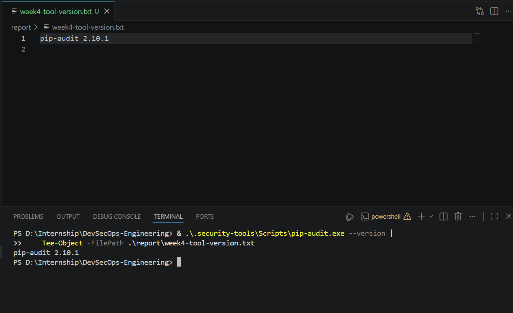
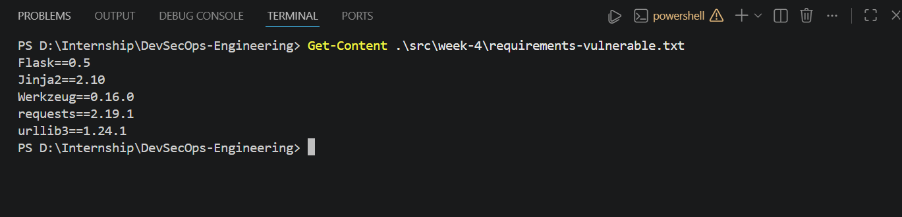
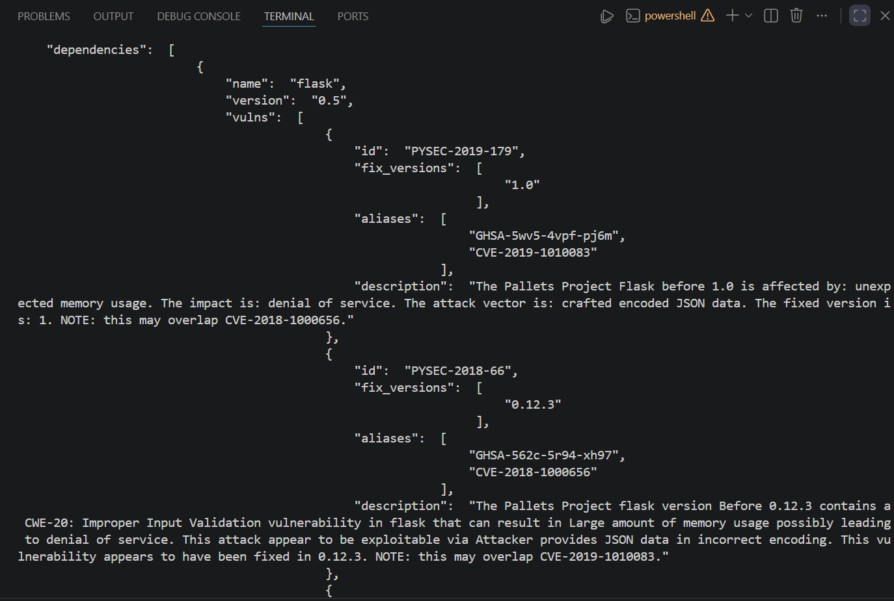
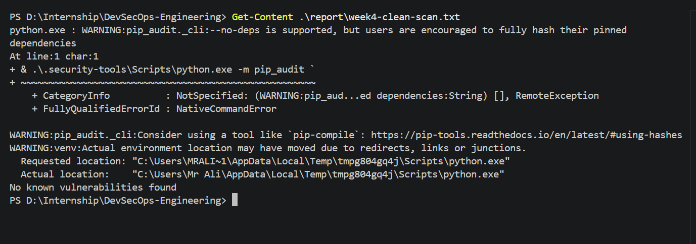

# Dependency Scanning

## Project Information

| Field | Value |
|---|---|
| Project | DevSecOps Engineering |
| Week | Week 4 |
| Topic | Dependency Scanning |
| Application | Python Flask Web Application |
| Tool | pip-audit |
| Repository | CyberMasterAli/devsecops-engineering |

## Introduction

Modern applications depend on third-party and open-source packages. These
packages reduce development time, but they may contain known security
vulnerabilities.

Dependency scanning is the process of identifying the software packages used
by an application and checking their versions against public vulnerability
databases.

The Week 4 task demonstrates dependency scanning for a Python Flask web
application using `pip-audit`.

## Objectives

The objectives of this task were to:

- Identify the direct and transitive dependencies used by the application.
- Detect known vulnerabilities in outdated Python packages.
- Record vulnerability identifiers and available fixed versions.
- Replace vulnerable dependencies with safe versions.
- Verify the remediated dependency set.
- Automate dependency scanning through GitHub Actions.

## Direct Dependencies

A direct dependency is a package explicitly selected by the application.

For this project, the direct dependency is:

```text
Flask
```

It is defined in:

```text
src/week-4/requirements.in
```

## Transitive Dependencies

A transitive dependency is installed because another package requires it.

Flask may install additional packages such as:

- Werkzeug
- Jinja2
- MarkupSafe
- Click
- Blinker
- ItsDangerous

These packages appear in the fully pinned file:

```text
src/week-4/requirements.txt
```

## Dependency Scanning Tool

The project uses `pip-audit`.

`pip-audit` examines Python package versions and compares them with known
security advisories. The scan can report:

- Package name
- Installed version
- Vulnerability identifier
- CVE or advisory alias
- Available fixed version
- Vulnerability description

## Tool Installation

The tool was installed in a separate security-tools virtual environment:

```powershell
py -m venv .security-tools

& .\.security-tools\Scripts\python.exe -m pip install --upgrade pip

& .\.security-tools\Scripts\python.exe -m pip install pip-audit
```

The installed version was verified with:

```powershell
& .\.security-tools\Scripts\python.exe -m pip_audit --version
```

## Initial Vulnerable Scan

A temporary requirements file containing an outdated dependency was created
for the controlled vulnerability demonstration.

Example:

```text
Flask==0.5
```

The scan was performed with:

```powershell
& .\.security-tools\Scripts\python.exe -m pip_audit `
    -r .\src\week-4\requirements-vulnerable.txt `
    --no-deps `
    --aliases on `
    --desc on
```

The initial scan detected known vulnerabilities in the outdated dependency.

The findings were saved in:

```text
report/week4-vulnerable-scan.txt
report/week4-vulnerable-scan.json
```

## Remediated Dependency Scan

A clean Python virtual environment was created and a current compatible Flask
version was installed.

The final dependencies were pinned in:

```text
src/week-4/requirements.txt
```

The remediated dependency set was scanned with:

```powershell
& .\.security-tools\Scripts\python.exe -m pip_audit `
    -r .\src\week-4\requirements.txt `
    --no-deps `
    --aliases on `
    --desc on
```

## Final Result

Final pip-audit result:

```text
[REPLACE WITH THE EXACT CONTENT OF report/week4-clean-scan.txt]
```

## Security Importance

Dependency scanning is important because an application may contain secure
custom code while still being exposed through an insecure third-party
component.

Dependency scanning helps the DevSecOps team detect vulnerable packages
before deployment.

## Evidence

### pip-audit installation



### Vulnerable dependency file



### Initial vulnerable scan


### Generated vulnerability report



### Final clean scan



## Conclusion

Dependency scanning was successfully implemented for the Python Flask web
application. Outdated dependencies were tested in a controlled environment,
known vulnerabilities were detected, remediation was performed, and the final
dependency set was rescanned.