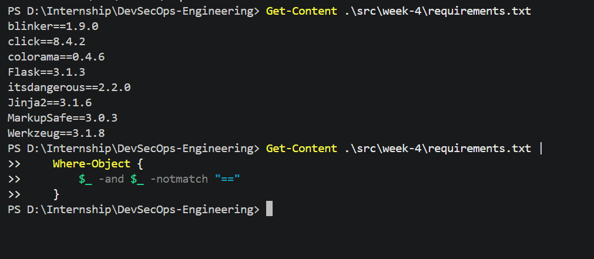
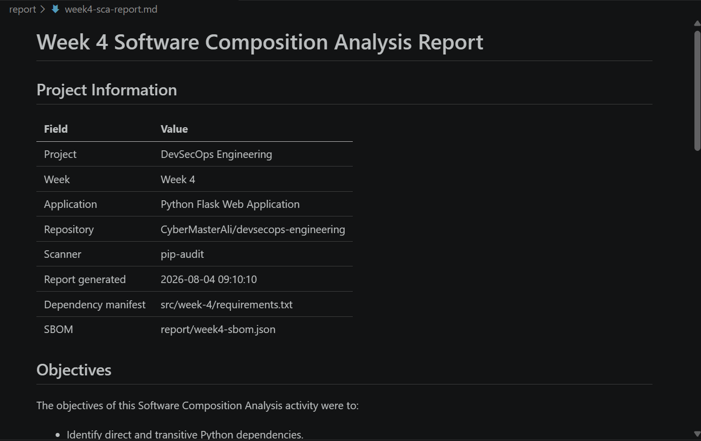
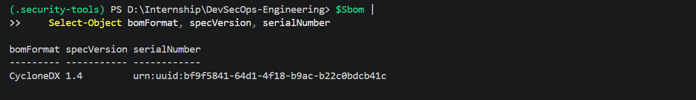
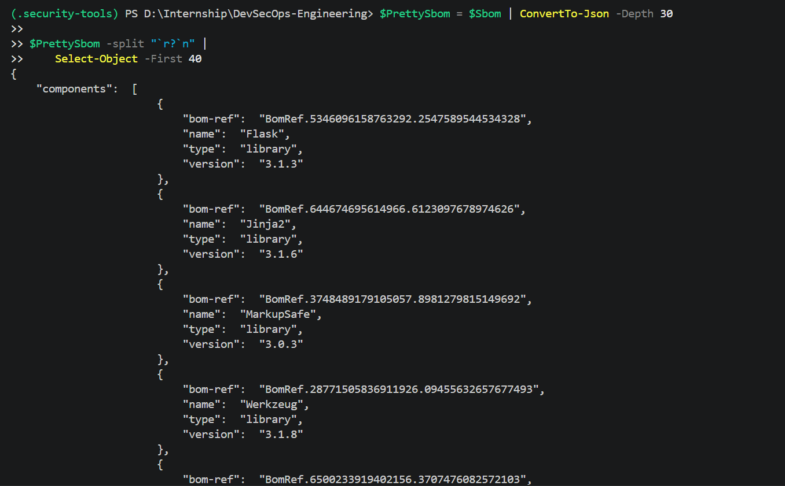

# Software Composition Analysis

## Project Information

| Field | Value |
|---|---|
| Project | DevSecOps Engineering |
| Week | Week 4 |
| Topic | Software Composition Analysis |
| Application | Python Flask Web Application |
| SCA Tool | pip-audit |
| SBOM Format | CycloneDX JSON |

## Introduction

Software Composition Analysis, commonly called SCA, is the process of
identifying and evaluating third-party and open-source components used by an
application.

SCA provides visibility into the application's software supply chain. It
helps teams understand which packages are installed, which versions are used,
whether known vulnerabilities exist, and whether remediation versions are
available.

## SCA Objectives

The Software Composition Analysis activity was performed to:

- Create an inventory of application dependencies.
- Identify direct and transitive packages.
- Detect known vulnerabilities.
- Record vulnerability identifiers.
- Identify available fixed versions.
- Verify remediation.
- Generate a Software Bill of Materials.
- Add automated dependency monitoring.

## Dependency Inventory

The project uses two dependency files.

### Direct dependency file

```text
src/week-4/requirements.in
```

This file records dependencies directly selected by the project.

### Fully pinned dependency file

```text
src/week-4/requirements.txt
```

This file records the complete resolved dependency tree, including direct and
transitive dependencies.

## Dependency Scanning and SCA Difference

Dependency scanning primarily focuses on identifying known vulnerabilities in
specific package versions.

Software Composition Analysis is broader. It can include:

- Component inventory
- Dependency relationships
- Vulnerability information
- Remediation versions
- Package licenses
- Package age and update status
- Software Bill of Materials generation
- Continuous dependency monitoring

Dependency scanning is therefore one important activity within SCA.

## SCA Process

The following process was completed:

1. Created a controlled vulnerable dependency manifest.
2. Scanned the outdated dependency with `pip-audit`.
3. Recorded detected vulnerability information.
4. Generated text and JSON vulnerability reports.
5. Created a clean Flask application environment.
6. Installed current compatible dependencies.
7. Generated a pinned `requirements.txt` file.
8. Rescanned the final dependency set.
9. Generated a CycloneDX JSON SBOM.
10. Added dependency scanning to GitHub Actions.
11. Configured Dependabot.
12. Added pull-request dependency review.

## Software Bill of Materials

A Software Bill of Materials, or SBOM, is a structured inventory of the
components included in an application.

The SBOM for this project is stored at:

```text
report/week4-sbom.json
```

The SBOM was generated in CycloneDX JSON format.

The SBOM contains information such as:

- Component name
- Component version
- Package type
- Package URL
- Dependency references
- SBOM format version
- Unique serial number

## SBOM Generation Command

```powershell
& .\.security-tools\Scripts\python.exe -m pip_audit `
    -r .\src\week-4\requirements.txt `
    --no-deps `
    --format cyclonedx-json `
    --output .\report\week4-sbom.json
```

## SCA Findings

The initial controlled scan identified known security vulnerabilities in an
outdated dependency.

The final application dependency set was created using current compatible
packages and was scanned again.

Final result:

```text
[REPLACE WITH THE EXACT FINAL SCAN RESULT]
```

## Risk Analysis

Third-party software may introduce security risks even when the application's
own source code is secure.

Possible risks include:

- Confidentiality loss
- Data exposure
- Application compromise
- Denial of service
- Dependency confusion
- Supply-chain compromise
- Unsupported or abandoned packages

SCA reduces these risks by providing continuous visibility into the components
used by the project.

## DevSecOps Benefits

Integrating SCA into DevSecOps provides:

- Early vulnerability detection
- Faster remediation
- Repeatable security testing
- Visibility into transitive packages
- Automated pull-request checks
- Continuous update monitoring
- Improved software supply-chain security

## Evidence

### Final dependency inventory



### SCA Markdown report



### SBOM generated



### SBOM preview



## Conclusion

Software Composition Analysis was successfully performed for the Python Flask
web application. The project documented its direct and transitive
dependencies, scanned them for known vulnerabilities, performed remediation,
generated a CycloneDX SBOM, and added automated dependency security controls.