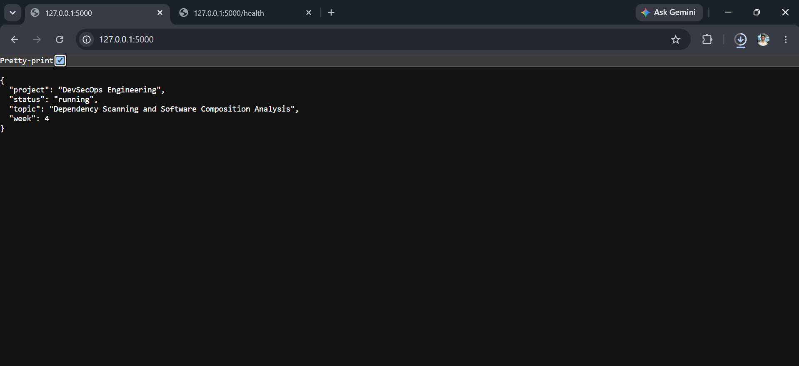
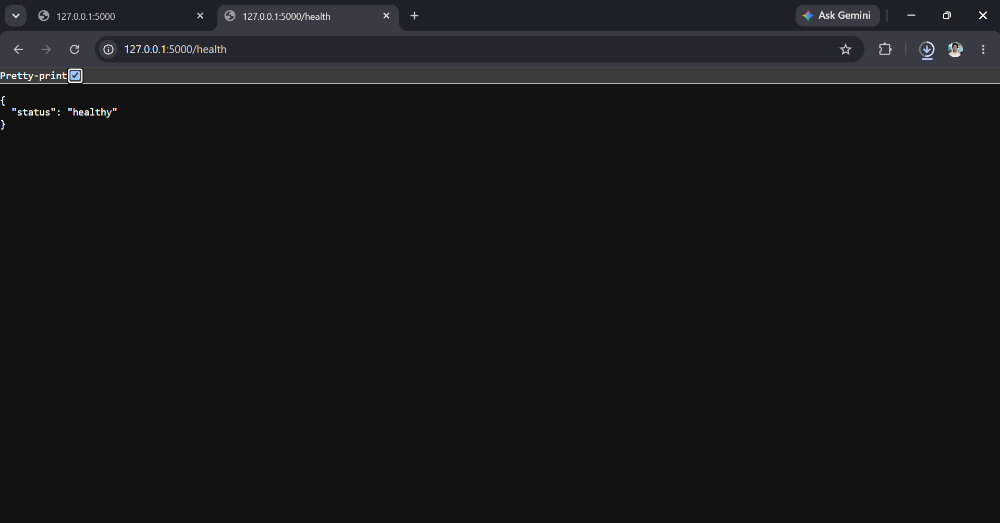

# Dependency Vulnerability Remediation

## Project Information

| Field | Value |
|---|---|
| Project | DevSecOps Engineering |
| Week | Week 4 |
| Application | Python Flask Web Application |
| Security activity | Dependency vulnerability remediation |
| Verification tool | pip-audit |

## Introduction

Remediation is the process of removing, upgrading, replacing, or mitigating a
component that contains a known security vulnerability.

The initial Week 4 scan used a deliberately outdated dependency to demonstrate
how Software Composition Analysis identifies vulnerable packages.

The vulnerable dependency was not used by the final application.

## Initial Condition

The controlled vulnerable manifest contained:

```text
Flask==0.5
```

The manifest was stored temporarily at:

```text
src/week-4/requirements-vulnerable.txt
```

It was scanned with `pip-audit`, and the results were stored in:

```text
report/week4-vulnerable-scan.txt
report/week4-vulnerable-scan.json
```

## Detected Findings

Complete the following table using the actual initial scan output.

| Package | Vulnerable Version | Vulnerability ID | Fixed Version | Remediation |
|---|---:|---|---:|---|
| [ACTUAL PACKAGE] | [ACTUAL VERSION] | [ACTUAL ID] | [ACTUAL FIX] | Upgraded or removed |
| [ADD MORE ROWS WHEN REQUIRED] | | | | |

## Remediation Strategy

The remediation strategy consisted of the following actions:

1. Preserve the initial findings as text and JSON reports.
2. Record screenshots showing the vulnerabilities.
3. Avoid installing or deploying the outdated package.
4. Create a clean application virtual environment.
5. Install a current compatible Flask release.
6. Generate a fully pinned final dependency manifest.
7. Scan the final dependency manifest.
8. Generate a CycloneDX SBOM.
9. Remove the temporary vulnerable dependency file.
10. Add automated dependency scanning to GitHub Actions.

## Clean Application Environment

The final application environment was created with:

```powershell
py -m venv .venv
```

The current compatible dependency was installed from:

```text
src/week-4/requirements.in
```

The resolved package versions were recorded using:

```powershell
& .\.venv\Scripts\python.exe -m pip freeze
```

The resulting pinned dependency file is:

```text
src/week-4/requirements.txt
```

## Verification Scan

The remediated dependency set was verified with:

```powershell
& .\.security-tools\Scripts\python.exe -m pip_audit `
    -r .\src\week-4\requirements.txt `
    --no-deps `
    --aliases on `
    --desc on
```

Final verification result:

```text
[PASTE THE EXACT CONTENT OF report/week4-clean-scan.txt]
```

## Removal of the Vulnerable Manifest

After the vulnerability reports and screenshots were created, the temporary
vulnerable manifest was removed.

Command used:

```powershell
Remove-Item .\src\week-4\requirements-vulnerable.txt -Force
```

The file was removed because keeping it could:

- Cause accidental installation of an insecure package.
- Create unnecessary dependency alerts.
- Misrepresent the final application dependency state.
- Introduce avoidable software supply-chain risk.

The scan reports were preserved as evidence.

## Remediation Verification

| Verification item | Status |
|---|---|
| Initial vulnerabilities recorded | Completed |
| Text vulnerability report generated | Completed |
| JSON vulnerability report generated | Completed |
| Clean environment created | Completed |
| Current dependencies installed | Completed |
| Final dependency manifest pinned | Completed |
| Final dependency scan completed | Completed |
| CycloneDX SBOM generated | Completed |
| Vulnerable manifest removed | Completed |
| GitHub Actions scan added | Completed |

## Evidence

### Current dependencies installed


### Flask application running



### Health endpoint



### Final verification scan


## Conclusion

The vulnerable dependency was successfully identified in a controlled scan.
The final application was built using current compatible dependencies, the
complete dependency set was pinned and rescanned, and the temporary vulnerable
manifest was removed.