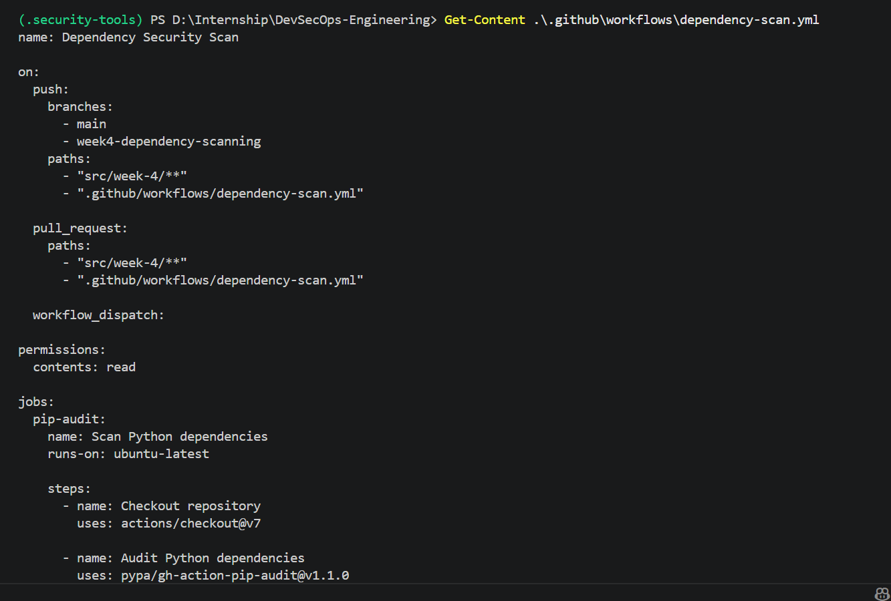
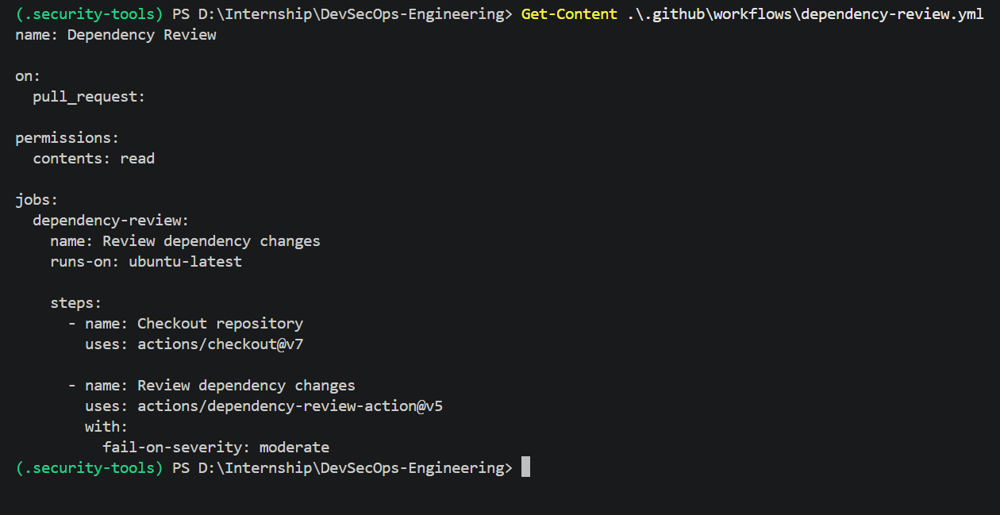
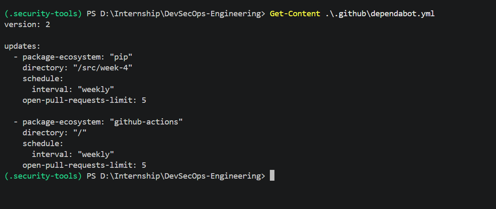
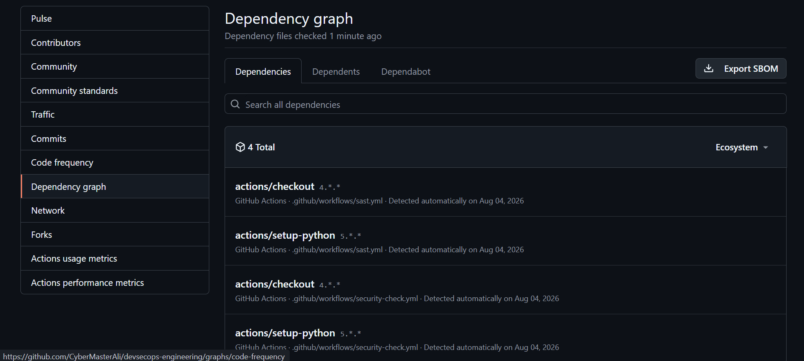

# GitHub Actions Dependency Scanning

## Project Information

| Field | Value |
|---|---|
| Project | DevSecOps Engineering |
| Week | Week 4 |
| Automation platform | GitHub Actions |
| Dependency scanner | pip-audit |
| Pull-request control | Dependency Review |
| Update automation | Dependabot |

## Introduction

DevSecOps integrates security checks into the software development and
delivery process.

For Week 4, dependency scanning was added to GitHub Actions so that Python
dependencies can be checked automatically when changes are pushed or reviewed
through pull requests.

## Security Automation Components

The project uses three dependency security controls:

1. A `pip-audit` GitHub Actions workflow.
2. A pull-request Dependency Review workflow.
3. Dependabot dependency update configuration.

## Dependency Scan Workflow

The dependency scan workflow is stored at:

```text
.github/workflows/dependency-scan.yml
```

The workflow scans:

```text
src/week-4/requirements.txt
```

It runs when:

- Changes are pushed to the configured branches.
- A pull request changes Week 4 dependency files.
- The workflow is started manually.

## Workflow Configuration

```yaml
name: Dependency Security Scan

on:
  push:
    branches:
      - main
      - week4-dependency-scanning
    paths:
      - "src/week-4/**"
      - ".github/workflows/dependency-scan.yml"

  pull_request:
    paths:
      - "src/week-4/**"
      - ".github/workflows/dependency-scan.yml"

  workflow_dispatch:

permissions:
  contents: read

jobs:
  pip-audit:
    name: Scan Python dependencies
    runs-on: ubuntu-latest

    steps:
      - name: Checkout repository
        uses: actions/checkout@v7

      - name: Audit Python dependencies
        uses: pypa/gh-action-pip-audit@v1.1.0
        with:
          inputs: src/week-4/requirements.txt
          no-deps: true
          summary: true
```

## Dependency Review Workflow

The pull-request dependency review workflow is stored at:

```text
.github/workflows/dependency-review.yml
```

It reviews dependency changes introduced by a pull request.

The workflow is configured to fail when a newly introduced vulnerable
dependency meets or exceeds the configured severity threshold.

## Dependency Review Configuration

```yaml
name: Dependency Review

on:
  pull_request:

permissions:
  contents: read

jobs:
  dependency-review:
    name: Review dependency changes
    runs-on: ubuntu-latest

    steps:
      - name: Checkout repository
        uses: actions/checkout@v7

      - name: Review dependency changes
        uses: actions/dependency-review-action@v5
        with:
          fail-on-severity: moderate
```

## Dependabot Configuration

Dependabot is configured in:

```text
.github/dependabot.yml
```

It performs weekly checks for:

- Python packages under `/src/week-4`
- GitHub Actions used by the repository

## Dependabot Configuration

```yaml
version: 2

updates:
  - package-ecosystem: "pip"
    directory: "/src/week-4"
    schedule:
      interval: "weekly"
    open-pull-requests-limit: 5

  - package-ecosystem: "github-actions"
    directory: "/"
    schedule:
      interval: "weekly"
    open-pull-requests-limit: 5
```

## Security Gate

The dependency scan acts as a security gate.

When `pip-audit` detects a known vulnerability, the workflow returns a failed
status. The failed check informs developers that the dependency change should
be remediated before it is merged.

The dependency review workflow adds another layer of protection by examining
new dependency changes introduced through pull requests.

## DevSecOps Benefits

The automated controls provide:

- Continuous dependency scanning
- Earlier vulnerability detection
- Pull-request security checks
- Repeatable security validation
- Automated dependency update pull requests
- Improved software supply-chain visibility

## Evidence

### Dependency scan workflow



### Dependency Review workflow



### Dependabot configuration



### Successful GitHub Actions checks


### Dependabot enabled



## Conclusion

Dependency scanning was successfully integrated into the GitHub development
workflow. The project now uses local scanning, GitHub Actions, Dependency
Review, and Dependabot to detect and manage dependency security risks.